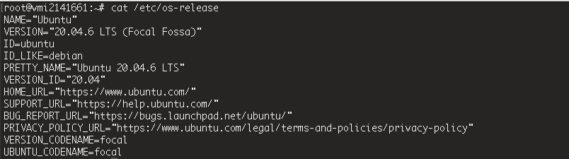
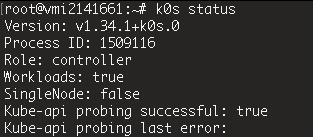
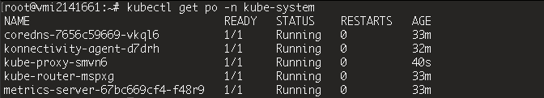
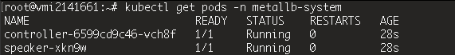

### Intro

With the fastest era of the tech industry, I think every software engineer has to catch up with this knowledge. Thats why I kicked off my project to learn K8s. The first stack I chose was K0s, recommended by my ex-leader, who’s super clever and talented. 


> - Please keep in mind, this isn’t a guidebook — it’s my diary, so don’t expect too much.


No more rambling, lets dive in!

---

# Preparation

I didn’t wanna run it on my local machine, so I decided to install it on my VPS. It’s finally time to use it after letting it collect dust for ages



Make sure those port are accessible. If you have a firewall enabled, you’ll need to allow these ports
```sh
# Control plane
sudo ufw allow 6443/tcp    # Kubernetes API server
sudo ufw allow 8132/tcp    # k0s admin API

# Node communication
sudo ufw allow 10250/tcp   # kubelet API
sudo ufw allow 10256/tcp   # kube-proxy
sudo ufw allow 2379:2380/tcp  # etcd client/peer
sudo ufw allow 179/tcp     # BGP (Calico/MetalLB)
sudo ufw allow 30000:32767/tcp # NodePort range

# Ingress / HTTP(S)
sudo ufw allow 80/tcp
sudo ufw allow 443/tcp

# DNS lookup outbound
sudo ufw allow out 53/tcp
sudo ufw allow out 53/udp
```

---
# Seek the flame 🔥
## K0s
Kick your as* into reading the [K0s docs](https://docs.k0sproject.io/stable/) first before taking any next steps.

- Download latest k0s
```sh
curl --proto '=https' --tlsv1.2 -sSf https://get.k0s.sh | sudo sh

sudo curl -sSLf https://get.k0s.sh | sudo sh
```

- Install controller plane
```sh
sudo k0s install controller --enable-worker --no-taints
```
> - `--no-tains` removes the default taint from the control plane, allowing the scheduler to place regular Pods on this node.

- Start k0s
```sh
sudo k0s start
```

> However, if you want to access the cluster from somewhere else (or use an independent install of kubectl), you’ll need the `KUBECONFIG` file. When you create the server, k0s automatically generates a `KUBECONFIG` file for you, so just copy it to your working directory and point to it.

- Configure `KUBECONFIG`
```sh
sudo cp /var/lib/k0s/pki/admin.conf ./admin.conf
export KUBECONFIG=./admin.conf
```


Ok! Looks cool now!

---
## Configure kube-proxy for MetalLB compatibility
k0s doesn’t come with a built-in load balancer, so I have to set up a real one myself. I decided to go with MetalLB
Enable IPVS mode and strictARP
```sh
export EDITOR=nano
kubectl edit configmap -n kube-system kube-proxy
```
Change content to:
```yml
apiVersion: v1
data:
    config.conf: |-
        kind: KubeProxyConfiguration
        mode: "ipvs"
        ipvs: {...,"strictARP":true}
```
Restart kube-proxy pods:
```sh
kubectl delete pod -n kube-system -l k8s-app=kube-proxy
```

Make sure all Pods in the kube-system namespace are running
```sh
kubectl get pod -n kube-system
```


---
## Install MetalLB
### Go apply metallb manifest
```bash
kubectl apply -f https://raw.githubusercontent.com/metallb/metallb/v0.15.2/config/manifests/metallb-native.yaml

kubectl get pods -n metallb-system
```


- If `MetalLB` fails to create the memberlist secret automatically, create it manually
```sh
kubectl create secret generic -n metallb-system memberlist --from-literal=secretkey="$(openssl rand -base64 128)"
```

- If you accidentally applied `MetalLB` before setting up `kube-proxy`, do a rollout restart:
```sh
# Check which resources exist
kubectl get deployments,daemonsets -n metallb-system 

# If there’s a Deployment
kubectl rollout restart deployment/controller -n metallb-system 

# If there’s a DaemonSet
kubectl rollout restart daemonset/speaker -n metallb-system
```
### Configure IP Address Pool
Create a configuration file for MetalLB
```yml
apiVersion: metallb.io/v1beta1
kind: IPAddressPool
metadata:
  name: first-pool
  namespace: metallb-system
spec:
  addresses:
  - YOUR_VPS_PUBLIC_IP/32 # cause VPS have only 1 Public IP so using /32 for subnet mask 255.255.255.255
---
apiVersion: metallb.io/v1beta1
kind: L2Advertisement
metadata:
  name: example
  namespace: metallb-system
spec:
  ipAddressPools:
  - first-pool
```
> Remember to replace `YOUR_VPS_PUBLIC_IP`
> - `IPAddressPool`: Defines the range of IP addresses that MetalLB can allocate
> - `L2Advertisement`: Configures Layer 2 mode to announce IPs externally
> - `ipAddressPools`: Links the L2Advertisement to specific IP pools

Apply configuration
```bash
kubectl apply -f metallb-config.yaml
```

Verify configuration
```bash
# for ipaddresspool
kubectl get ipaddresspool -n metallb-system

# for l2advertisement
kubectl get l2advertisement -n metallb-system
```

Ok, done with the LB, the last thing is the Ingress Controller. Maybe I’ll go with Traefik instead of Nginx Ingress Controller. That’ll be in the next post. 

Now, I’m heading back to the bonfire 🔥

<!--more-->
